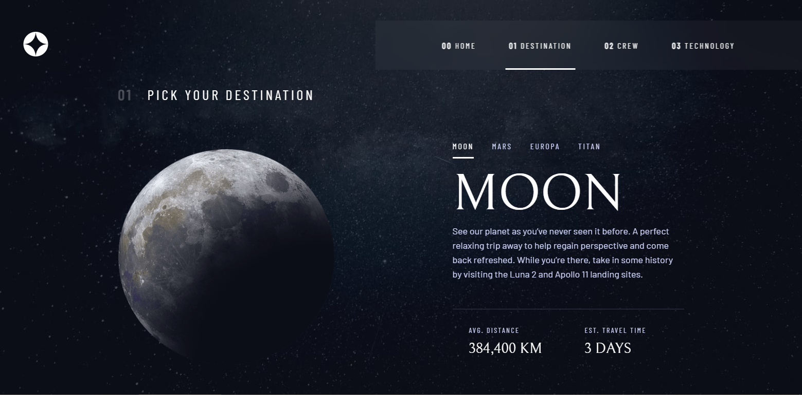

# Space Tourism Multi Page



## Descrição

Este é um projeto fictício de um site de turismo espacial multi página, desenvolvido como parte do desafio da Frontend Mentor. O objetivo deste projeto é criar várias páginas que apresentam destinos emocionantes no espaço sideral e oferecem informações detalhadas sobre cada um deles. Desenvolvido com React, TypeScript, Framer Motion e styled-components.

[Link do Site](https://space-tourism-multi-page-website-v2.vercel.app)


## Funcionalidades

- Navegação intuitiva entre as páginas de destino espacial.
- Informações detalhadas sobre cada destino, incluindo descrição, custo e duração.
- Animações suaves e interativas para uma experiência envolvente.
- Estilização elegante e responsiva com styled-components.
- Breve descrição da equipe.

## Como Executar

1. Clone este repositório em sua máquina local.
2. Instale as dependências usando o comando:
   ```
   npm install
   ```
3. Inicie o aplicativo com:
   ```
   npm run dev
   ```
4. Abra o aplicativo no seu navegador.

## Contribuições

Contribuições são bem-vindas! Sinta-se à vontade para abrir problemas ou enviar pull requests.
